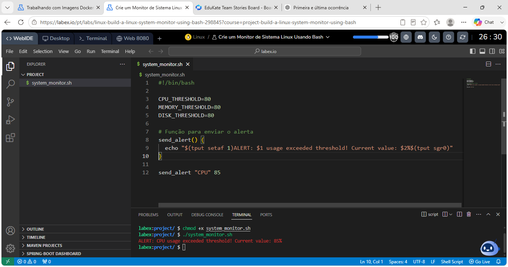
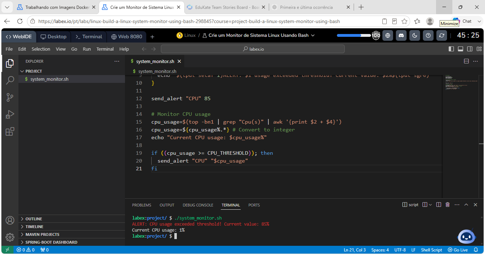
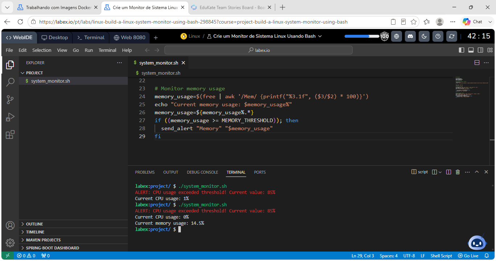
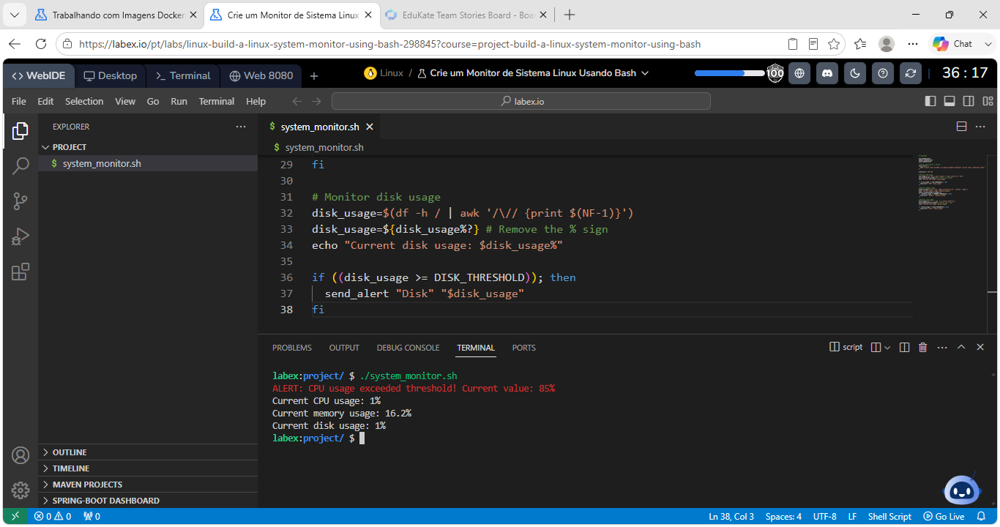
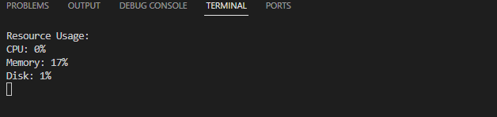

# Linux System Monitor using Bash

A lightweight Linux system monitoring tool written in Bash. This project continuously monitors CPU, memory, and disk usage, refreshing every two seconds and displaying alerts whenever a predefined threshold is exceeded.

---

## Features

- Continuous monitoring using a `while` loop
- CPU usage monitoring
- Memory usage monitoring
- Disk usage monitoring
- Configurable thresholds
- Automatic terminal refresh every 2 seconds
- Colored alert messages

---

## Technologies

- Bash
- Linux
- awk
- grep
- top
- free
- df
- tput

---

## Project Structure

```text
linux-system-monitor-bash/
│
├── README.md
├── system_monitor.sh
└── images/
    ├── alert-function.png
    ├── cpu-monitor.png
    ├── memory-monitor.png
    ├── disk-monitor.png
    └── running-script.png
```

---

## Threshold Configuration

```bash
CPU_THRESHOLD=80
MEMORY_THRESHOLD=80
DISK_THRESHOLD=80
```

The thresholds can be modified according to your monitoring requirements.

---

## Alert Function

Whenever one of the monitored resources exceeds its configured threshold, the script calls the following function:

```bash
send_alert() {
    echo "$(tput setaf 1)ALERT: $1 usage exceeded threshold! Current value: $2%$(tput sgr0)"
}
```

The `tput` command changes the terminal color, making alerts easier to identify.



---

## CPU Monitoring

CPU utilization is collected using the `top` command.

```bash
cpu_usage=$(top -bn1 | grep "Cpu(s)" | awk '{print $2 + $4}')
cpu_usage=${cpu_usage%.*}

if ((cpu_usage >= CPU_THRESHOLD)); then
    send_alert "CPU" "$cpu_usage"
fi
```

The script extracts the CPU utilization percentage, converts it to an integer, and compares it with the configured threshold.



---

## Memory Monitoring

Memory usage is calculated using the `free` command.

```bash
memory_usage=$(free | awk '/Mem/ {printf("%3.1f", ($3/$2) * 100)}')
memory_usage=${memory_usage%.*}

if ((memory_usage >= MEMORY_THRESHOLD)); then
    send_alert "Memory" "$memory_usage"
fi
```

The script calculates the percentage of used memory before checking whether it exceeds the configured threshold.



---

## Disk Monitoring

Disk usage is collected from the root filesystem.

```bash
disk_usage=$(df -h / | awk '/\// {print $(NF-1)}')
disk_usage=${disk_usage%?}

if ((disk_usage >= DISK_THRESHOLD)); then
    send_alert "Disk" "$disk_usage"
fi
```

The percentage symbol is removed before the numerical comparison.



---

## Continuous Monitoring

The script runs continuously inside an infinite loop.

Each iteration:

- Collects CPU usage
- Collects memory usage
- Collects disk usage
- Displays alerts when necessary
- Refreshes the terminal
- Waits two seconds before starting again

```bash
while true; do
  # Monitor CPU
  cpu_usage=$(top -bn1 | grep "Cpu(s)" | awk '{print $2 + $4}')
  cpu_usage=${cpu_usage%.*}
  if ((cpu_usage >= CPU_THRESHOLD)); then
    send_alert "CPU" "$cpu_usage"
  fi

  # Monitor memory
  memory_usage=$(free | awk '/Mem/ {printf("%3.1f", ($3/$2) * 100)}')
  memory_usage=${memory_usage%.*}
  if ((memory_usage >= MEMORY_THRESHOLD)); then
    send_alert "Memory" "$memory_usage"
  fi

  # Monitor disk
  disk_usage=$(df -h / | awk '/\// {print $(NF-1)}')
  disk_usage=${disk_usage%?}
  if ((disk_usage >= DISK_THRESHOLD)); then
    send_alert "Disk" "$disk_usage"
  fi

  # Display current stats
  clear
  echo "Resource Usage:"
  echo "CPU: $cpu_usage%"
  echo "Memory: $memory_usage%"
  echo "Disk: $disk_usage%"

  sleep 2
done
```

The monitor updates every **2 seconds**, providing a lightweight real-time monitoring experience directly in the Linux terminal.



---

## Example Output

```text
Resource Usage:

CPU: 5%
Memory: 28%
Disk: 11%
```

If a threshold is exceeded:

```text
ALERT: CPU usage exceeded threshold! Current value: 86%
```

---

## Linux Commands Used

| Command | Purpose |
|----------|---------|
| `top` | Retrieves CPU utilization |
| `free` | Displays memory usage |
| `df` | Displays disk usage |
| `awk` | Processes command output |
| `grep` | Filters command output |
| `tput` | Displays colored terminal messages |
| `clear` | Clears the terminal screen |
| `sleep` | Controls the refresh interval |

---

## Skills Practiced

- Bash scripting
- Linux command line
- Functions
- Variables
- Infinite loops
- Conditional statements
- Command substitution
- Text processing using `awk` and `grep`
- Linux system monitoring
- Terminal formatting

---

## Future Improvements

- Save alerts to a log file
- Add timestamps to alerts
- Monitor network usage
- Monitor the top CPU-consuming processes
- Send email notifications
- Export monitoring metrics to CSV

---

## Author

**Julio Cesar Teixeira de Lima**

This project was developed as part of my Linux and Bash scripting studies to strengthen my skills in Linux system administration, automation, and scripting.
